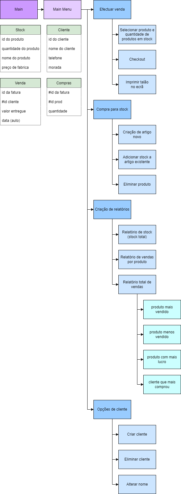

Este projecto é um trabalho em C++ para a UFCD 0789 do Curso de *Técnico Especialista em Tecnologias e Programação de Sistemas de Informação* que estou a tirar na ATEC.

É um programa para ser utilizado pelo trabalhador numa loja para fazer a gestão de vendas, stock e clientes.

### Setup

Na primeira vez que se abre o programa, não há base de dados, as tabelas estão todas vazias então é necessário usar a opção "BD default" nas "Definições" de modo a criar a base de dados com valores de teste.

---

# Sobre o programa:

## Custom IO functions

### Custom Inputs

`int customCini(console_out conout)`
`float customCinf(console_out conout)`
>Custom input que só aceita numeros, "i" só retorna int, "f" só retorna float.

`string customCins(conout_out conout)`
>Custom input que retorna a linha toda como uma string.

### Custom Output

`void customCout(console_out *conout, string text)`
>Imprime o *text* centrado por cima da input box.

`string setPrecision2(float input)`
>Retorna uma string da *input* com duas casas decimais.

## ImprovSQL

### Select

`string selectSQL(int index_return, string **table, int index_value, string value)`
>Retorna o valor da *table* na coluna *index_return* onde a coluna *index_value* é igual a *value*.

### Gestão de tabelas

`int checkLineOf(string **table, int X, string value)` 
>Retorna o index da linha da *table* onde a coluna *X* é igual a *value*, retorna *-1* se não existe.

`int checkHighestId(string **table, int X)`
>Retorna o maior valor numérico da coluna *X* da *table* .

`void cleanLine(string **table, int Y, int C)`
>Apaga os valores da *table* na linha *Y*. *C* é o número de colunas da *table*.

`bool compactTable(string **table, int C)`
>Movimenta todos os valores da *table* "para cima" de modo a compactar a tabela eliminando espaços vazios.

`bool txtGet(string fileName, string **table, int *sizeTable)`
>Importa os valores do ficheiro *fileName* para a tabela *table*.

`bool txtSet(string fileName, string **table, int sizeTable, int C)`
>Exporta os valores da tabela *table* para o ficheiro *fileName*.

### Display das tabelas

`void showClientes(console_out *conout, string **clientes, int *sizeClientes, bool left)`  
`void showStock(console_out *conout, string **stock, int *sizeStock, bool left, bool venda)`  
`void showCart(console_out *conout, string **stock, string **cart, int *sizeCart, bool left)`  
`void showVendas(console_out *conout, string **vendas, int *sizeVendas, string **clientes, bool left)`  
>Imprime as tabelas de *clientes*, *stock*, *cart* e *vendas* na consola.

## Outros

- Todas as tabelas têm um maximo de 100 linhas e são matrizes de strings.
- Caso as tabelas de preenchimento automático (*Vendas* e *Compras*) estejam cheias (com 100 linhas) a tabela arranja espaço suficiente apagando as linhas mais antigas. Ao apagar essas linhas, para não deixar informação não relacionada, apaga também as linhas referentes à mesma transação da outra tabela.
- Para fazer a confirmação das inputs usei os `customCini` e `customCinf` de maneira a só aceitar números quando necessário.
- Para ler strings completas (incluindo espaços) usei o `customCins`.  
- Para evitar repetições de dados usei o `checkLineOf`, se retornasse *-1* então não existia na tabela e aceitava a input.  
- Sempre que se elimina algo, pede para confirmar a ação.
- Nos relatórios por produto/cliente a pesquisa é feita apartir do nome em vez do id.  
- Para a manipulação da consola usei a livraria [cppconlib](https://github.com/mariusbancila/cppconlib) do [mariusbancila](https://github.com/mariusbancila).
- Para a importação e exportação da base de dados usei a livraria [fstream](https://cplusplus.com/reference/fstream/fstream/).
- No menu das "Settings" há 3 opções: 
  - "Update DB" que obriga o programa a reler os ficheiros txt e atualiza a base de dados,
  - "Save DB" que escreve a base de dados nos ficheiros txt devidos (para o caso de algum se apagar),
  - "DB default" que põe os valores default nas tabelas e ficheiros txt devidos.
- O sorteio da venda tem 20% de chance de oferecer a compra.

## Base de dados em Matrizes

Dicionário  
`chave primaria`

#### Stock
| `0`  | 1    | 2          | 3                |
| ---- | ---- | ---------- | ---------------- |
| `id` | nome | quantidade | preço de fabrica |

#### Clientes
| `0`  | 1    | 2        | 3      |
| ---- | ---- | -------- | ------ |
| `id` | nome | telefone | morada |

#### Vendas
| `0`            | 1          | 2              | 3    |
| -------------- | ---------- | -------------- | ---- |
| `id de fatura` | id cliente | valor entregue | data |

#### Compras
| `0`         | `1`          | 2          |
| ----------- | ------------ | ---------- |
| `id fatura` | `id produto` | quantidade |

#### Cart
(é uma tabela que guarda valores temporariamente)
| `0`          | 1          |
| ------------ | ---------- |
| `id produto` | quantidade |

---

## Esquema dos menus + Tabelas das bases de dados

