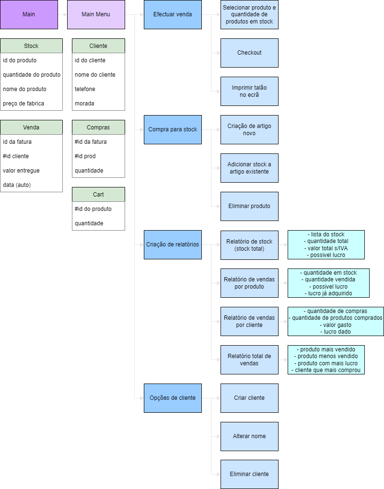

This is a C++ project for the UFCD 0789 of the *Specialist Technician in Technologies and Information Systems Programming* course that I am taking at ATEC.

It is a program to be used by a worker in a store to manage sales, stock, and customers.

[PT](README_portuguese.md)

### Setup

The first time the program is opened, there is no database, the tables are all empty, so it is necessary to use the "Default DB" option in the "Settings" in order to create the database with example values.

---

# About the program:

## Custom IO functions

### Custom Inputs

`int customCini(console_out conout)`
`float customCinf(console_out conout)`
>Custom input that only accepts numbers, "i" only returns int, "f" only returns float.

`string customCins(conout_out conout)`
>Custom input that returns the whole line as a string.

### Custom Output

`void customCout(console_out *conout, string text)`
>Prints the *text* centered above the input box.

`string setPrecision2(float input)`
>Returns a string of the *input* with two decimal places.

## ImprovSQL

### Select

`string selectSQL(int index_return, string **table, int index_value, string value)`
>Returns the value of the *table* in the *index_return* column where the *index_value* column is equal to *value*.

### Table management

`int checkLineOf(string **table, int X, string value)` 
>Returns the index of the row in the *table* where the column *X* is equal to *value*, returns *-1* if it doesn't exist.

`int checkHighestId(string **table, int X)`
>Returns the highest numeric value of column *X* in table.

`void cleanLine(string **table, int Y, int C)`
>Deletes the values in *table* in row *Y*. *C* is the number of columns in *table*.

`bool compactTable(string **table, int C)`
>Moves all values in the *table* "up" to compact the table and eliminate empty spaces.

`bool txtGet(string fileName, string **table, int *sizeTable)`
>Imports the values from the file *fileName* to the *table*.

`bool txtSet(string fileName, string **table, int sizeTable, int C)`
>Exports the values of the *table* to the file *fileName*.

### Table display

`void showClientes(console_out *conout, string **clientes, int *sizeClientes, bool left)`  
`void showStock(console_out *conout, string **stock, int *sizeStock, bool left, bool venda)`  
`void showCart(console_out *conout, string **stock, string **cart, int *sizeCart, bool left)`  
`void showVendas(console_out *conout, string **vendas, int *sizeVendas, string **clientes, bool left)`  
>Prints the *clientes*, stock, cart, and *vendas* tables in the console.

## Other

- All tables have a maximum of 100 rows and are string matrices.
- In case the automatic fill tables (Sales and Purchases) are full (with 100 rows), the table makes enough space by deleting the oldest rows. When deleting these lines, in order to not leave unrelated information behind, it also deletes the lines related to the same transaction in the other table.
- To confirm inputs, I used `customCini` and `customCinf` to only accept numbers when necessary.
- To read complete strings (including spaces) I used customCins.
- To avoid data repetition, I used checkLineOf, if it returned -1 then it did not exist in the table and accepted the input.
- Whenever something is removed, it asks for confirmation of the action.
- In the product/customer reports, the search is based on the name instead of the id.
- For console manipulation, I used the library [cppconlib](https://github.com/mariusbancila/cppconlib) by [mariusbancila](https://github.com/mariusbancila).
- For importing and exporting the database, I used the [fstream](https://cplusplus.com/reference/fstream/fstream/) library.
- In the "Settings" menu there are 3 options:
  - "Update DB" which makes the program read the txt files and updates the database,
  - "Save DB" which writes the database to the txt files (in case one of them gets deleted),
  - "DB default" which puts default values in the tables and txt files.
- The sale raffle has a 20% chance of offering the purchase.

## Data bases in matrices

Dictionary  
`primary key`

#### Stock
| `0`  | 1    | 2        | 3               |
| ---- | ---- | -------- | --------------- |
| `id` | name | quantity | "factory" price |

#### Clientes (Clients)
| `0`  | 1    | 2     | 3       |
| ---- | ---- | ----- | ------- |
| `id` | name | phone | address |

#### Vendas (Sales)
| `0`           | 1         | 2     | 3    |
| ------------- | --------- | ----- | ---- |
| `id purchase` | id client | money | date |

#### Compras (Products sold)
| `0`           | `1`          | 2        |
| ------------- | ------------ | -------- |
| `id purchase` | `id product` | quantity |

#### Cart
(it's a temporary table)
| `0`          | 1        |
| ------------ | -------- |
| `id product` | quantity |

---

## Menu scheme

